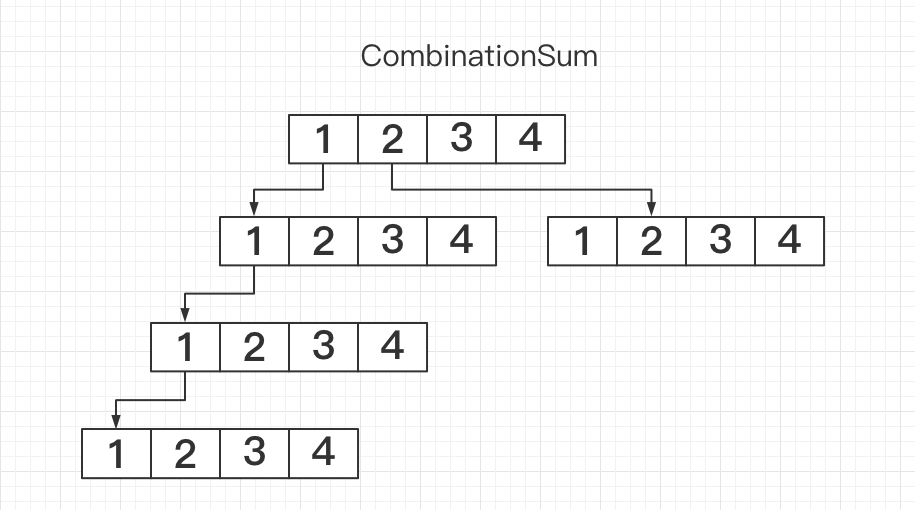

# match-schedule

###关键词：
playerNum 选手数 
fieldNum  场地数 
roundNum  轮数 
singleMode 单人赛 
doubleMode 双人赛 
amplitude  振幅【偏离平均值的差值】

###约束：
#####单人赛: 
队伍数量 * 场次 % 2 ==0 
队伍数量 > 场次数量 * 2 

#####双人赛: 
队伍数量 * 场次 % 4 ==0 
队伍数量 > 场次数量 * 4 

### 流程
#### 分场地 
1. 根据振幅/搜索深度，生成有限场地分配组合（CombinationSum）
选举数组为顺序递增数组 [min...max]
min = playerNum / fields + amplitude
max = playerNum / fields - amplitude
搜索深度 deep = fieldNum

2. 过滤不符合的组合（filterField）
3. 根据与平均值的方差和选中最优解（OptimalFieldChoice）
#### 分组
1. 从选手池随机挑选选手（根据mode选择人数2 或 4),从选手池删除，并添加到历史记录【遇到随机相同的孤儿,重新计算】
2. 处理剩余的孤儿选手，平均插入到已有的分队后

